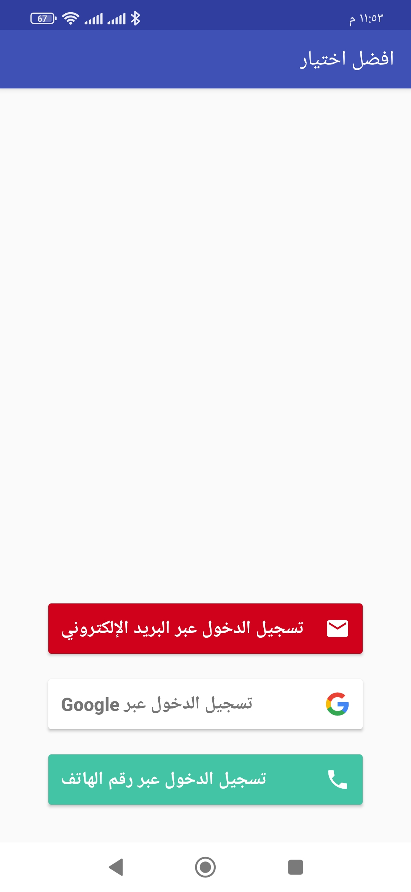
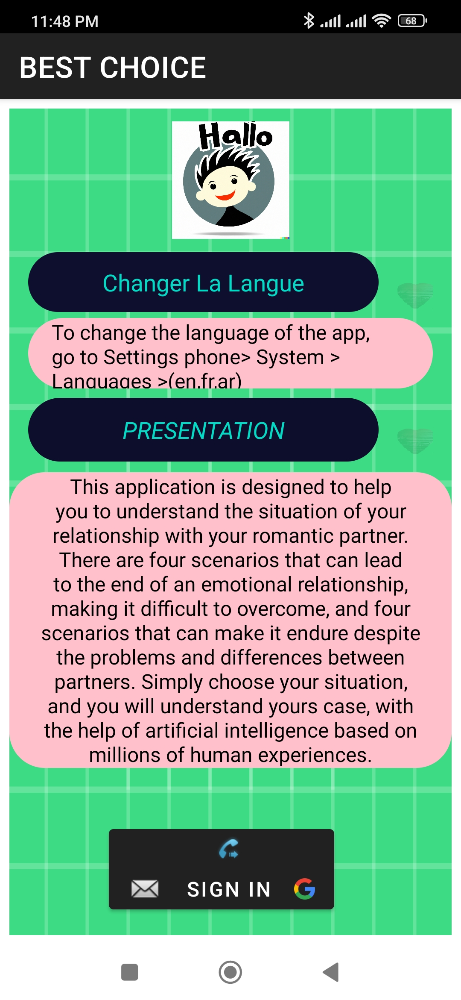
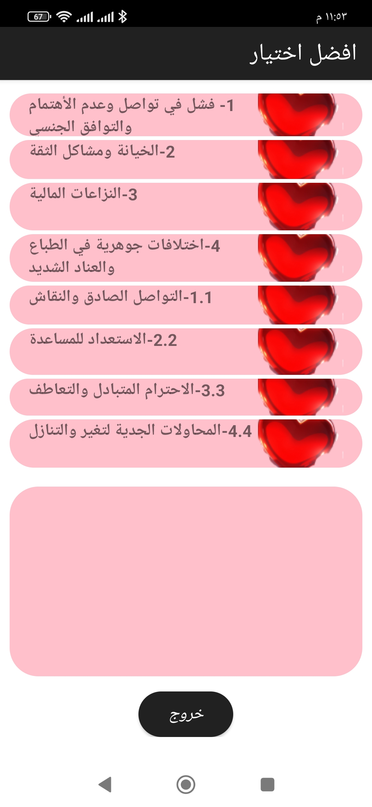
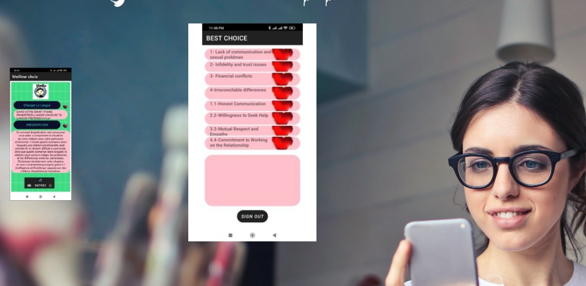

# choice
App Development Model
Build Your App Easily with This Model
Our app development model is designed to simplify the process of creating your own app. It provides a ready-to-use foundation that you can customize according to your specifications.

Kotlin and Java Support
Whether you prefer Kotlin or Java for your app development, our model has you covered. It supports both programming languages, allowing you to choose the one that you are most comfortable with.

Ready-Made Features
Our model comes equipped with a range of pre-built features that you can leverage for your app. These features include user authentication, data storage, API integration, and support for three languages (English, French, Arabic), among others. By using our model, you can save time and effort by starting with a solid foundation that already includes essential functionalities.

Demo
DEMO <!-- [video ](https://youtu.be/PvoDHAi8OPg)-->
[DEMOE](https://youtu.be/VeND5cWX34w)

##  link to google play:
https://play.google.com/store/apps/details?id=com.walid580.choice

Screenshots
Here are some screenshots of the app:

## App Screenshots

### 1. Sign In

### 2. First Page

### 3. Arabic Page

### 4. Presentation

